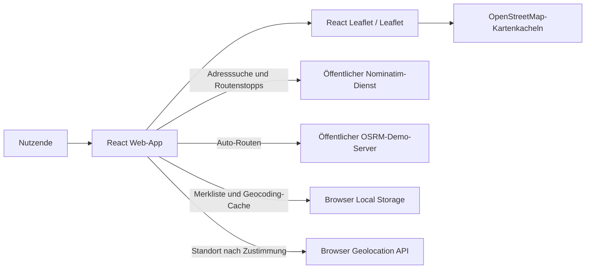

# CivixX – Knowledge Map

## Zweck und Produkt

CivixX ist eine interaktive Karte für Bildungseinrichtungen in Leipzig und Umgebung. Nutzende können Adressen suchen, ihren Standort anzeigen lassen, Auto-Routen zwischen zwei Adressen berechnen und Orte durch einen Klick auf die Karte lokal merken. Eine Backend-Anbindung, Anmeldung oder Synchronisierung ist nicht aktiv.

## Systemübersicht



## Einstiegspunkte und wichtige Dateien

| Bereich | Datei | Zuständigkeit |
| --- | --- | --- |
| Projektbeschreibung | `README.md` | Produktüberblick, Funktionen und Entwicklungsbefehle |
| React-Einstieg | `dist-react/index.html`, `dist-react/src/main.jsx` | HTML-Shell, React-Mount, Leaflet-CSS und globale Styles |
| App-Komposition und Routing | `dist-react/src/App.jsx` | BrowserRouter und Routen für Karte, Rechtstexte und 404 |
| Hauptfunktionalität | `dist-react/src/components/CivixApp.jsx` | Kartenansicht, Suche, Routenberechnung, Geolocation, Marker und Merkliste |
| Persistenz-Hook | `dist-react/src/hooks/useLocalStorage.js` | JSON lesen/schreiben und Fehler des lokalen Speichers abfangen |
| Gemeinsames Seitenlayout | `dist-react/src/components/SiteLayout.jsx` | Header, Navigation, Footer und Rahmen für React-Seiten |
| Rechtliche React-Seiten | `dist-react/src/pages/Privacy.jsx`, `dist-react/src/pages/Cookies.jsx`, `dist-react/src/pages/Terms.jsx` | Datenschutz, Cookie-Hinweise und Nutzungsbedingungen |
| Darstellung | `dist-react/src/index.css` | Globale, Layout-, Karten- und Komponenten-Styles |
| Build-Konfiguration | `dist-react/vite.config.js`, `dist-react/package.json` | Vite-Konfiguration, Skripte und Abhängigkeiten |
| Ältere Rechtstexte | `privacy.html`, `cookies.html`, `terms.html` | Eigenständige statische Fassungen außerhalb des React-Routings |
| Statische React-Assets | `dist-react/public/` | Kopien der Rechtstexte und statische Assets für Vite |
| Legacy/Standalone-App | `index.html` | Separate ältere Leaflet-Implementierung mit Konto-Menü und Kartenfunktionen |

## Hauptabläufe

### Adresssuche

1. Das Suchformular in `CivixApp.jsx` übergibt die Eingabe an `submitSearch` und `geocode`.
2. Die App ruft den öffentlichen Nominatim-Endpunkt `search` auf und begrenzt die Suche auf Deutschland sowie das Leipziger `BOUNDS`-Rechteck.
3. Erfolgreiche Geocoding-Ergebnisse werden mit 24 Stunden Ablaufzeit im Browser unter `civixx.geocodeCache` gespeichert; beim Start werden nur noch gültige Cache-Einträge geladen.
4. Die Karte prüft das Ergebnis gegen `BOUNDS`, fliegt mit `SearchFlyTo` zur Adresse und zeigt Marker sowie Statusmeldung. Laufende Geocoding-Anfragen können über `AbortController` abgebrochen werden.

### Markierungen, Favoriten und Kartenklick

- Ein Klick auf die freie Karte setzt eine nummerierte Markierung (maximal 50). Ist gerade ein Ort ausgewählt, hebt der Klick nur die Auswahl auf.
- Markierungen liegen über `useLocalStorage` unter `civixx.markers`, Favoriten (nur Einrichtungen) unter `civixx.savedPlaces.v2`.
- Markierungen lassen sich einzeln entfernen (Papierkorb im Tab „Markierungen“ oder „Entfernen“ in der Detailkarte nach Klick auf den Pin) sowie gesammelt über „Alle entfernen“. Jede Entfernung kann über „Rückgängig“ in der Statusmeldung zurückgenommen werden.
- Suchergebnis-Pin, Standort-Pin und Route sind ebenfalls entfernbar (Detailkarte bzw. Schließen-Knopf der Routenleiste). Wird ein Endpunkt einer Route entfernt, verschwindet auch die Route.
- Markierungen, Favoriten und Geocoding-Cache verlassen den Browser nicht.

### Routenberechnung

1. Nutzende geben Start und Ziel ein; beide Adressen werden parallel über dieselbe Nominatim-Geocoding-Funktion aufgelöst.
2. Beide Koordinaten müssen innerhalb von `BOUNDS` liegen.
3. Die App fragt den öffentlichen OSRM-Demo-Server unter `router.project-osrm.org` mit dem Profil `driving` ab.
4. Eine erfolgreiche GeoJSON-Geometrie wird in Leaflet-Koordinaten umgewandelt und als Polyline gezeichnet. Die Karte springt zum Startpunkt.

### Standort

- `navigator.geolocation` fragt den Browser nach Berechtigung und verwendet hohe Genauigkeit, ein Timeout von zehn Sekunden und einen maximal 30 Sekunden alten Messwert.
- Der Standort wird nur angezeigt, wenn er innerhalb des Leipziger Bereichs liegt.
- Er wird nicht automatisch in der Merkliste gespeichert.

## Technische Bausteine

- React 19 und React DOM
- React Router DOM 7 für clientseitiges Routing
- Vite 8 mit React-Plugin
- React Leaflet 5 und Leaflet 1.9
- OpenStreetMap-Kacheln für die Karte
- Nominatim für Adress-Geocoding
- OSRM-Demo-Server für Auto-Routen
- Browser Local Storage für Merkliste und Geocoding-Cache
- Browser Geolocation API für die optionale Standortanzeige

## Geografischer Bereich

Die Karte startet bei Leipzig (`51.3397, 12.3731`) und wird durch `BOUNDS` in `dist-react/src/components/CivixApp.jsx` begrenzt. Geocoding-Ergebnisse und der Standort werden ebenfalls gegen diese Grenzen geprüft. Änderungen an der unterstützten Region sollten Kartenbegrenzung und Ergebnisprüfungen gemeinsam berücksichtigen.

## Datenschutz und externe Abhängigkeiten

- Kartenkacheln werden von `tile.openstreetmap.org` geladen.
- Adress- und Routenstopps gehen an den öffentlichen Nominatim-Dienst; Routing-Anfragen gehen an `router.project-osrm.org`.
- Der Standortzugriff erfolgt über die Browser-API und erfordert Nutzerzustimmung.
- Merkliste und Geocoding-Cache liegen im Local Storage.
- Die React-Karte verwendet keine Anmeldung und keine serverseitige Synchronisierung. Die Standalone-`index.html` enthält weiterhin einen älteren Konto-Bereich; die Google-Anmeldung und Synchronisierung sind laut README vorbereitet, aber nicht aktiv.
- Rechtstexte liegen im Projektstamm und in `dist-react/public/`; React-Routen nutzen die Komponenten unter `dist-react/src/pages/`. Änderungen sollten die jeweiligen Fassungen abgleichen.

## Entwicklung

In `dist-react/`:

```bash
npm install
npm run dev
```

Produktions-Build und lokale Vorschau:

```bash
npm run build
npm run preview
```

Zusätzlich ist `npm run lint` (Oxlint) definiert. Es gibt im Paket derzeit kein Testskript.

## Bekannte Zustände und zu beachtende Punkte

- Die React-App unter `dist-react/` ist die im README beschriebene Version. Das Root-`index.html` ist eine separate ältere Standalone-App und wird vom React-Routing nicht gerendert.
- Die React-Version bietet Karte, Suche, Standort, Merkliste, Routenberechnung und Hinweise. Konto-/Google-Anmeldung erscheint nur in der Standalone-`index.html`.
- Nominatim und der OSRM-Demo-Server sind öffentliche Dienste. Verfügbarkeit und Nutzungsbedingungen liegen außerhalb der App; der lokale Cache betrifft nur Geocoding-Ergebnisse, nicht die Kartenkacheln oder Routen.
- `FlyTo` übernimmt die animierte Navigation zu Such-, Standort-, Listen- und Routenzielen.
- Layout: ab 861 px Seitenleiste (Suche, Tabs „Orte / Favoriten / Markierungen“) neben einer fensterhohen Karte; darunter Suche, Karte und Listen untereinander. Statusmeldung, Routenleiste und Detailkarte liegen als Overlay über der Karte. Farben sind CSS-Variablen mit Hell- und Dunkelmodus (`prefers-color-scheme`).

## Orientierung für Änderungen

- UI und Nutzerabläufe: `dist-react/src/components/CivixApp.jsx`
- Kartenregion oder Startansicht: Konstanten `LEIPZIG` und `BOUNDS` in derselben Datei
- Local Storage-Verhalten: `dist-react/src/hooks/useLocalStorage.js`
- Routing und 404: `dist-react/src/App.jsx`
- Gemeinsamer Seitenrahmen: `dist-react/src/components/SiteLayout.jsx`
- Rechtstexte: `dist-react/src/pages/` sowie Root-Dateien und `dist-react/public/`
- Globale Gestaltung: `dist-react/src/index.css`
- Abhängigkeiten und Befehle: `dist-react/package.json`
- Standalone-Version: `index.html` im Projektstamm
