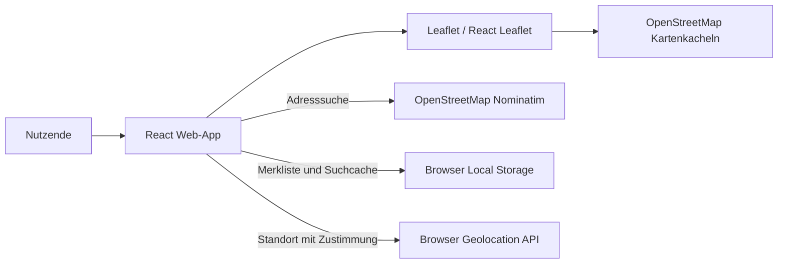

# CivixX – Knowledge Map

## Zweck und Produkt

CivixX ist eine interaktive Karte für Bildungseinrichtungen in Leipzig und Umgebung. Nutzende können eine Adresse suchen, ihren Standort anzeigen und Orte direkt auf der Karte merken. Die Merkliste wird lokal im Browser gespeichert.

## Systemübersicht



Es gibt aktuell keinen Backenddienst. Anmeldung und Synchronisierung sind nicht aktiviert.

## Einstiegspunkte und wichtige Dateien

| Bereich | Datei | Zuständigkeit |
| --- | --- | --- |
| Projektbeschreibung | `README.md` | Funktionen, Seiten und lokale Entwicklungsanleitung |
| React Einstieg | `dist-react/index.html`, `dist-react/src/main.jsx` | HTML-Shell, React-Mount, globale Styles und Leaflet-CSS |
| App-Komposition | `dist-react/src/App.jsx` | Rendert die CivixX-Anwendung |
| Hauptfunktionalität | `dist-react/src/components/CivixApp.jsx` | Karte, Suche, Geolocation, Marker und Merkliste |
| Persistenz-Hook | `dist-react/src/hooks/useLocalStorage.js` | JSON lesen/schreiben und Fehler des lokalen Speichers abfangen |
| Darstellung | `dist-react/src/index.css` | Globale und Komponenten-Styles |
| Build-Konfiguration | `dist-react/vite.config.js`, `dist-react/package.json` | Vite-Konfiguration, Skripte und Abhängigkeiten |
| Rechtliche Informationen | `privacy.html`, `cookies.html`, `terms.html` | Datenschutz, Cookie-Hinweise, Nutzungsbedingungen |
| Legacy/Standalone-App | `index.html` | Ältere eigenständige Leaflet-Implementierung mit Suche, Konto-Menü und Karte |

`dist-react/public/` enthält Kopien der Rechtstexte und statische Assets für die React-Ausgabe.

## Hauptabläufe

### Adresssuche

1. Das Formular in `CivixApp.jsx` nimmt die Eingabe an.
2. Die App fragt den öffentlichen Nominatim-Endpunkt (`search`) ab und beschränkt die Suche auf Deutschland sowie das definierte Leipziger Kartenrechteck.
3. Erfolgreiche Ergebnisse werden bis zu 24 Stunden im Local Storage unter `civixx.geocodeCache` zwischengespeichert.
4. Die Karte fliegt zum Ergebnis; ein Suchmarker und eine Statusmeldung werden angezeigt.

### Merkliste und Kartenklick

- Ein Klick auf die Karte erzeugt einen Marker und fügt Koordinaten und Label der Merkliste hinzu.
- Der Hook `useLocalStorage` speichert die Liste unter `civixx.savedPlaces`.
- Das Merkliste-Panel kann Orte erneut auf der Karte anzeigen oder entfernen.
- Die Daten verlassen bei diesem Ablauf nicht den Browser.

### Standort

- Die App verwendet `navigator.geolocation` und fragt den Browser nach Berechtigung.
- Der Standort wird nur angezeigt, wenn er innerhalb des definierten Leipzig-Bereichs liegt.
- Standortdaten werden nicht in der Merkliste gespeichert, solange Nutzende den Ort nicht selbst merken.

## Technische Bausteine

- React 19, React DOM und Vite 8
- React Leaflet 5 und Leaflet 1.9
- OpenStreetMap-Kacheln für die Kartendarstellung
- Nominatim für Geocoding
- Browser Local Storage für Merkliste und Suchcache
- Browser Geolocation API für die optionale Standortanzeige

## Geografischer Bereich

Die Karte startet bei Leipzig (`51.3397, 12.3731`) und ist durch `BOUNDS` in `dist-react/src/components/CivixApp.jsx` räumlich begrenzt. Das Suchergebnis und der Standort werden zusätzlich gegen diese Grenzen geprüft. Änderungen an der unterstützten Region sollten daher Kartenbegrenzung und Ergebnisprüfung gemeinsam berücksichtigen.

## Datenschutz und externe Abhängigkeiten

- Für die Karte werden Kacheln von `tile.openstreetmap.org` geladen.
- Adressanfragen gehen an den öffentlichen Nominatim-Dienst.
- Der Standortzugriff erfolgt über die Browser-API und erfordert Nutzerzustimmung.
- Gemerkte Orte und Geocoding-Cache liegen im Local Storage.
- Google OAuth und serverseitige Synchronisierung sind laut README und Datenschutztext vorbereitet, aber nicht implementiert.
- Die Rechtstexte liegen sowohl im Projektstamm als auch unter `dist-react/public/`; bei Änderungen sollten beide Fassungen abgeglichen werden.

## Entwicklung

In `dist-react/`:

```bash
npm install
npm run dev
```

Produktions-Build und lokale Vorschau:

```bash
npm run build
npm run preview
```

Im Paket sind außerdem `npm run lint` (Oxlint) und die Vite-Skripte definiert. Das Root-README beschreibt zusätzlich, wie die statischen Root-Dateien über einen einfachen Python-Webserver geöffnet werden.

## Bekannte Zustände und zu beachtende Punkte

- Die React-App ist die im Root-README beschriebene Version. `index.html` im Projektstamm ist eine separate ältere Standalone-App; Änderungen an der React-App ändern diese Datei nicht automatisch.
- Die React-Version bietet laut aktuellem Quellcode Karte, Suche, Standort, Merkliste und Hinweise. Ein Konto-/Google-Anmeldebereich ist dort nicht vorhanden; er kommt nur in der Standalone-`index.html` vor.
- Nominatim-Aufrufe unterliegen den Nutzungsbedingungen und der Verfügbarkeit des öffentlichen Dienstes. Der Cache reduziert wiederholte Anfragen, ist aber kein Backend- oder Offline-Cache für Kartenkacheln.
- `MapReady` setzt den Ladezustand der Karte; Suchnavigation wird über `SearchFlyTo` umgesetzt.
- Es sind im Quellcode keine Testskripte definiert; Build- und Lint-Skripte sind vorhanden.

## Orientierung für Änderungen

- UI und Nutzerabläufe: `dist-react/src/components/CivixApp.jsx`
- Kartenregion oder Startansicht: Konstanten `LEIPZIG` und `BOUNDS` in derselben Datei
- Local Storage-Verhalten: `dist-react/src/hooks/useLocalStorage.js`
- Globale Gestaltung: `dist-react/src/index.css`
- Rechtstexte: Root-Dateien und entsprechende Dateien in `dist-react/public/`
- Abhängigkeiten und Befehle: `dist-react/package.json`
- Standalone-Version: `index.html` im Projektstamm
